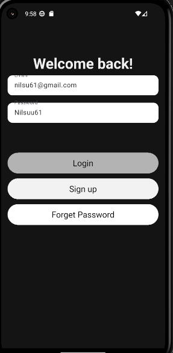
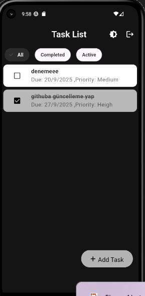
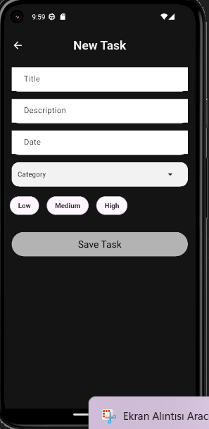
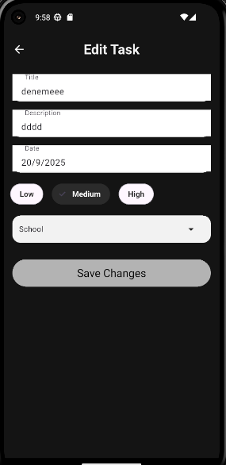

# ToDoApp

Flutter ile geliştirilmiş state management yöntemi olarak provider kullanılmış yapılacaklar listesi (ToDo) uygulaması.
Uygulama demosu:

## Demo

[▶ Uygulama Demosunu İzle](uygulamademo.mp4)

## Ekran Görüntüleri

| Giriş                        | Görev Listesi                | Görev Ekleme                 | Görev Düzenleme              |
| ---------------------------- | ---------------------------- | ---------------------------- | ---------------------------- |
|  |  |  |  |

## Kurulum

## Gereksinimler

- Flutter: 3.35.3-0.0.pre-2 (stable)
- Dart: 3.9.0
- VS Code: 1.104.1
- Android Studio: Ladybug Feature Drop | 2024.2.2 Patch 2
- Emulator: Pixel 5 API 33 (Android 13.0 "Tiramisu") x86_64

## Kullanılan Paketler

- firebase_core: 3.15.1
- firebase_auth: 5.6.2
- cloud_firestore: 5.6.11
- fluttertoast: 8.2.12
- image_field: 0.0.12
- auto_route: ^7.8.2
- auto_route_generator: ^7.2.0
- provider: ^6.1.5

## Projeyi çalıştırmak için :

Bu projeyi klonlayın:

```bash
 git clone https://github.com/nilsukonak/STAJ22002.git
 cd ToDoApp
 flutter pub get
```

## Emulator Kullanımı

Ben uygulamayı Android Studio Emulator üzerinde test ettim.Siz mobil cihazınıza bağlayarak ta test edebilirsiniz.
Kullandığım Emülatör: Pixel 5 API 33 (Android 13.0 "Tiramisu") x86_64
Kodlar Visual Studio Code üzerinde yazıldı ancak emülatör Android Studio üzerinden açıldı.

VS Code → Run/Debug → emülatörü seçerek uygulamayı çalıştırabilirsiniz.

Eğer emülatörünüz yoksa, Android Studio üzerinden yeni bir sanal cihaz oluşturabilirsiniz.

Tools > Device Manager menüsünden Pixel 5 seçip Android 13 (API 33) veya istediğiniz başka bir emülatörü indirin.

Emülatörü başlatın, ardından terminalde:
flutter run
komutunu çalıştırın.
Eğer sorun yaşarsanız flutter doctor komutunu çalıştırarak eksikleri görebilirsiniz.

## Proje yapısı

```plaintext
lib/
├── data/
│   ├── repositories/           →  Firebase işlemleri
│   └── firebase_options.dart   → Firebase konfigürasyon dosyası (FlutterFire CLI ile üretilir)
│
├── helpers/
│   ├── app_color.dart          → Uygulamada kullanılan renkler
│   └── validation_helper.dart  → Form doğrulama , kontrol fonksiyonu
│
├── models/
│   └── task_model.dart         → Görev model sınıfı
│
├── presentation/
│   ├── providers/              → State management (Provider) için sınıflar
│   ├── routes/                 → Uygulama yönlendirmeleri (Route tanımları)
│   ├── themes/
│       └── theme.dart              → Uygulamanın genel tema ayarları
│   └── screens/                → Uygulama ekranları
│       ├── auth/               → Kayıt / Giriş ekranları
│       └── tasks/              → Görev yönetimi ekranları
│           ├── edit_task.dart
│           ├── new_tasks.dart
│           ├── task_list.dart
│           └── tasks.dart
│
│
│   │── widgets/
│       ├── chip_selector.dart      → Chip seçici widget
│       ├── date_picker.dart        → Tarih seçici widget
│       └── dropdown_menu.dart      → Dropdown menü widget
│
└── main.dart                   → Uygulamanın giriş noktası

```
